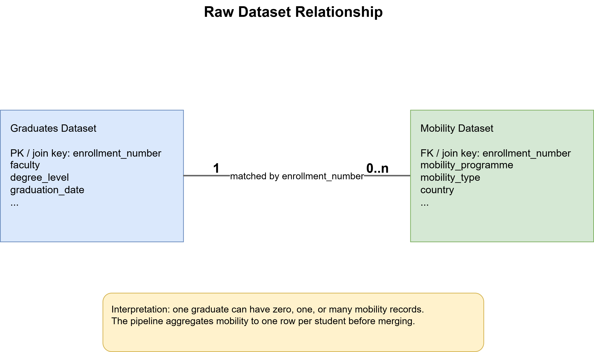

# Privacy-Aware Data Integration

Configurable end-to-end pipeline for preparing, anonymizing, and validating linked graduates and mobility datasets with:

- `k`-anonymity
- `l`-diversity
- `t`-closeness

The project is designed for tabular datasets where:

- the **graduates dataset** contains one row per graduate
- the **mobility dataset** contains zero, one, or many mobility records per student

The pipeline helps you:

1. inspect the raw data
2. configure how the datasets should be merged
3. build a prepared merged dataset
4. configure anonymization on the prepared dataset
5. run privacy checks
6. export an anonymized dataset that can be used for downstream reporting

## Repository Structure

```text
.
|-- config/
|   |-- preparation_config.json
|   `-- anonymization_config.json
|-- data/
|   |-- graduates/
|   `-- mobility/
|-- output/
|   |-- prepared_dataset.xlsx
|   |-- anonymized_dataset.xlsx
|   |-- anonymization_metrics.json
|   `-- anonymization_refinement.json
|-- src/
|   |-- anonymization.py
|   |-- loader.py
|   `-- configurable/
|-- create_preparation_config.py
|-- build_prepared_dataset.py
|-- run_anonymization.py
|-- data_init.py
`-- requirements.txt
```

## Installation

Use Python and install the dependencies from `requirements.txt`.

```powershell
python -m venv .venv
.\.venv\Scripts\Activate.ps1
pip install -r requirements.txt
```

### Included dependencies

- `pandas` for tabular data processing
- `openpyxl` for reading and writing `.xlsx`
- `xlrd` for reading `.xls`

## Supported Input Formats

The loader supports:

- `.xlsx`
- `.xls`
- `.csv`

You can point the pipeline either to:

- a **single file**
- or a **folder** containing multiple supported files

When a folder is used, all supported files in that folder are loaded and concatenated.

## Option 1: Generate Test Data

If you do not yet have real data, you can generate synthetic graduates and mobility datasets and test the full pipeline.

Run:

```powershell
python data_init.py
```

This creates example files in:

- `data/graduates/`
- `data/mobility/`

The synthetic data is built to demonstrate the pipeline and to make privacy checks achievable in a proof-of-concept setting.

## Option 2: Use Your Own Data

If you already have real data, you need **two datasets**:

### 1. Graduates dataset

This dataset should contain **one row per graduate**.

Typical examples of columns:

- student identifier
- faculty
- degree level
- graduation date
- study type

### 2. Mobility dataset

This dataset should contain **mobility events**, meaning:

- one student may have **zero**
- one student may have **one**
- one student may have **many** mobility rows

Typical examples of columns:

- student identifier
- mobility type
- mobility programme
- country
- EU / non-EU
- short-term / long-term
- mobility date

## Required Relationship Between the Two Datasets

The pipeline assumes a **one-to-many** relationship:

- one graduate in the graduates dataset
- may correspond to many mobility records in the mobility dataset



Before the merge:

- the mobility dataset is aggregated to **one row per student**

Then:

- the aggregated mobility table is merged into the graduates table

This means the prepared dataset always becomes a **student-level / graduate-level dataset**.

## Matching the Datasets

The merge is configured with:

- `join.left_on`
- `join.right_on`

This allows the join column to have:

- the same name in both datasets
- or different names in the two datasets

Example:

```json
"join": {
  "left_on": "student_id",
  "right_on": "matriculation_number",
  "join_type": "left",
  "left_dataset": "graduates",
  "right_dataset": "mobility"
}
```

The join type is currently expected to be:

- `left`

This keeps all graduates and attaches mobility information when available.

## Full Workflow


The pipeline has **three main stages**:

1. create the preparation config
2. build the prepared dataset and anonymization config
3. run anonymization and refinement

## Stage 1: Create the Preparation Config

Run:

```powershell
python create_preparation_config.py
```

By default this reads:

- `data/graduates`
- `data/mobility`

and writes:

- `config/preparation_config.json`

You can also pass custom locations:

```powershell
python create_preparation_config.py `
  --graduates path\to\graduates `
  --mobility path\to\mobility `
  --left-join-column graduate_id `
  --right-join-column mobility_student_id `
  --output config\preparation_config.json
```

### What this stage does

It reads the raw datasets and generates a configurable JSON template containing:

- dataset paths
- join settings
- column profiling
- semantic type suggestions
- mobility aggregation suggestions
- preparation-stage output paths

### File produced

- `config/preparation_config.json`

## Understanding `preparation_config.json`

This file is used to define how the raw datasets should be transformed into a prepared merged dataset.

### `datasets`

Defines the raw input sources:

- `graduates_path`
- `mobility_path`

### `join`

Defines how the datasets are matched:

- `left_on`: join column in graduates
- `right_on`: join column in mobility
- `join_type`: usually `left`

### `columns`

This section is mainly for exploration and semantic correction.

For each raw column you will see:

- `name`
- `semantic_type`
- `possible_semantic_types`
- `non_null_count`
- `unique_count`
- `sample_values`

Supported semantic types:

- `categorical`
- `numeric`
- `datetime`
- `boolean`
- `free_text`
- `identifier_like`
- `unknown`

If the detected semantic type is wrong, you can replace `semantic_type` with one of the allowed values.

### `mobility_aggregation`

This section defines how mobility rows are reduced to one row per student before the merge.

Each mobility column can specify:

- `selected`: aggregation function
- `allowed`: allowed aggregation functions for that column
- `filter`: optional filter values
- `available_filter_values`: sample values to help configuration
- `keep_after_merge`: whether to keep the aggregated result in the prepared dataset

Supported aggregation functions:

- `count`
- `first`
- `last`
- `min`
- `max`
- `mean`
- `sum`
- `mode`
- `nunique`

#### Example

```json
"eu_noneu": {
  "selected": "first",
  "allowed": ["first", "mode", "nunique", "count"],
  "filter": [],
  "keep_after_merge": true
}
```

#### Filtering mobility rows

You can filter the mobility dataset before aggregation.

Example:

```json
"status": {
  "selected": "first",
  "allowed": ["first", "mode", "nunique", "count"],
  "filter": ["student"],
  "keep_after_merge": false
}
```

This means:

- only mobility rows where `status = "student"` are kept
- then aggregation is applied

### `prepared_dataset`

This section defines what should happen after the merge.

#### `drop_columns`

Columns to remove from the prepared merged dataset.

This is the place where you typically remove:

- direct identifiers
- columns you do not want to carry into anonymization

#### `post_merge_missing_values`

When the join is left-based, graduates with no mobility will have missing values in mobility-derived columns.

Use this section to fill them.

Example:

```json
"post_merge_missing_values": {
  "mobility_record_count": 0,
  "eu_noneu": "No mobility",
  "short_long_term": "No mobility"
}
```

#### `transformations`

Transformations applied after the merge.

Currently supported operations:

- `extract_year`
- `bucket_numeric`
- `derive_boolean_from_numeric`
- `fill_missing_literal`

Examples:

- derive `graduation_year` from `graduation_date`
- derive `had_mobility` from `mobility_record_count`
- bucket mobility counts into `0`, `1`, `2+`

### `outputs`

Defines where the preparation stage writes:

- prepared merged dataset
- anonymization config

## Stage 2: Build the Prepared Dataset

After editing `config/preparation_config.json`, run:

```powershell
python build_prepared_dataset.py --config config/preparation_config.json
```

### Outputs of stage 2

- `output/prepared_dataset.xlsx`
- `config/anonymization_config.json`

### What this stage does

It:

1. loads the raw datasets
2. coerces configured semantic types
3. aggregates the mobility dataset to student level
4. merges mobility into graduates
5. fills post-merge missing values
6. applies preparation transformations
7. drops configured columns
8. profiles the prepared dataset
9. generates an anonymization config based on the prepared dataset

## Understanding `anonymization_config.json`

This file is used to define how the prepared merged dataset should be anonymized.

### `prepared_dataset`

Contains the path to the prepared dataset created in stage 2.

### `columns`

Profiles the prepared dataset in the same style as the raw column profiling:

- `name`
- `semantic_type`
- `possible_semantic_types`
- `non_null_count`
- `unique_count`
- `sample_values`

You can still correct semantic types here if needed.

### `selection`

Defines the key anonymization choices.

#### `drop_columns`

Additional columns to remove before anonymization.

#### `quasi_identifiers`

Columns used to define equivalence classes for `k`-anonymity.

These should be columns that can contribute to re-identification when combined.

#### `sensitive_attributes`

Columns you conceptually treat as sensitive in the release dataset.

#### `report_columns`

Columns intended to remain useful for downstream reporting.

### `suggestions`

Auto-generated suggestions based on the prepared dataset.

#### `qi_candidates`

Suggested quasi-identifier combinations.

These are based on the prepared merged dataset.

#### `generalization_candidates`

Distinct values for columns that are good candidates for value-mapping generalization.

### `transformations`

Optional additional transformations before privacy checks.

Supported operations are the same as in the preparation stage:

- `extract_year`
- `bucket_numeric`
- `derive_boolean_from_numeric`
- `fill_missing_literal`

### `generalizations`

Value-mapping rules used to generalize columns.

Example:

```json
"degree_level": {
  "Bachelor": "Undergraduate",
  "Master": "Graduate",
  "PhD": "Graduate"
}
```

### `privacy_targets`

Defines privacy evaluation settings.

#### `target_k`

Minimum equivalence class size after anonymization.

#### `sensitive_attributes_for_checks`

Sensitive attributes that should be evaluated for:

- `l`-diversity
- `t`-closeness

### `outputs`

Defines where anonymization outputs are written:

- anonymized dataset
- privacy metrics
- refinement file

## Stage 3: Run Anonymization

After editing `config/anonymization_config.json`, run:

```powershell
python run_anonymization.py --config config/anonymization_config.json
```

### Outputs of stage 3

- `output/anonymized_dataset.xlsx`
- `output/anonymization_metrics.json`
- `output/anonymization_refinement.json`

### What this stage does

It:

1. loads the prepared dataset
2. coerces configured semantic types
3. applies additional transformations
4. applies generalization mappings
5. removes selected columns
6. computes equivalence classes
7. evaluates `k`
8. suppresses rows in equivalence classes smaller than `target_k`
9. computes `l`-diversity and `t`-closeness for configured sensitive attributes
10. writes the anonymized dataset and privacy outputs

## Iterative Refinement

If you want another anonymization iteration, you do not need to manually copy the next config.

Run:

```powershell
python run_anonymization.py --refinement output/anonymization_refinement.json
```

The program will:

- read `next_config` from the refinement file
- use it as the input config for the next anonymization run

## How to Read `anonymization_metrics.json`

This file contains the main privacy results:

- `rows_before_suppression`
- `rows_after_suppression`
- `equivalence_class_count`
- `max_k_before_suppression`
- `quasi_identifiers`
- `target_k`
- per-sensitive-attribute:
  - `min_l_diversity`
  - `mean_l_diversity`
  - `max_t_distance`
  - `mean_t_distance`

## How to Read `anonymization_refinement.json`

This file is the decision-support output for the next iteration.

It contains:

- `status.report_ready`
- `status.rows_available_for_reports`
- `privacy_metrics`
- `suggestions`
- `next_config`

Use it like this:

- if `report_ready` is `true`, the anonymized dataset is usable for downstream reporting
- if not, review `suggestions`, edit the config, and run another iteration
- or run the next iteration directly using `--refinement`

## Practical Notes

- The graduates dataset should usually contain one row per student.
- The mobility dataset can contain multiple rows per student.
- The join keys do not need to have the same name.
- The prepared dataset is the correct place to define QIs, because it reflects the merged and cleaned structure actually being anonymized.
- Missing values for students without mobility should be handled in the preparation config, not left unresolved.
- The current pipeline exports an anonymized dataset and privacy-validation artifacts.
